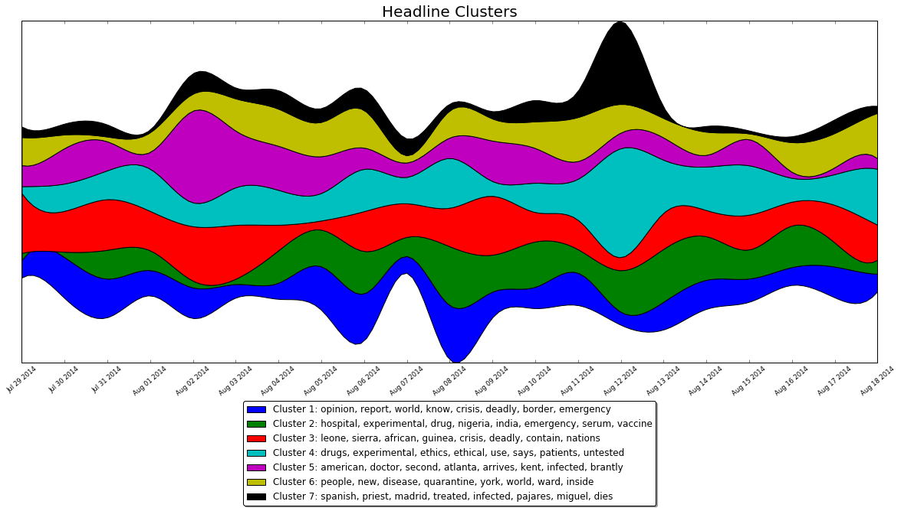

# News scraping, clustering, and visualization

Given a search query, start date, and end date, generates datafiles containing news article headlines from the specified date range, plus visualizations of related, subsidiary news topics as a function of time.

For example, given:
- Search query 'ebola'
- Start time July 29, 2014
- End time August 18, 2014

Produces:

## Process

- Scrape article headlines from google search "news" tab, using user agent specs and random time delays to bypass scraping restrictions
- Parse and clean data
- Apply tf-idf and k-means clustering to generate related, subsidiary news topics
- Apply tokenization, and stopword removal to article headlines
- Create dictionary of cluster topic terms, match article headline tokens to cluster topic terms, create ratios of matched cluster topic terms against total number of tokens
- Group by date, prepare data for visualization, plot with matplotlib
- Tune hyperparameters (max_df, cluster count, terms per cluster, etc.) of k-means to reduce noise and enhance information content of visualization (Automation TK)
