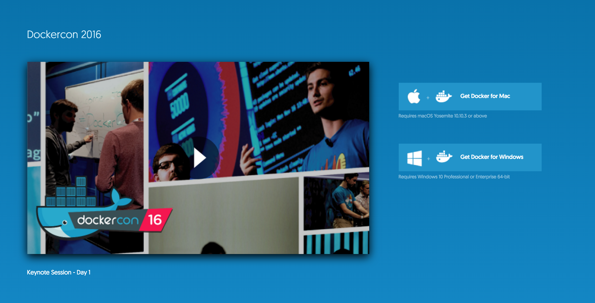
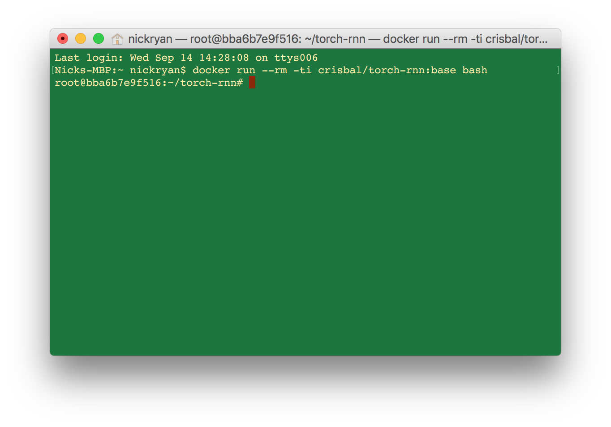
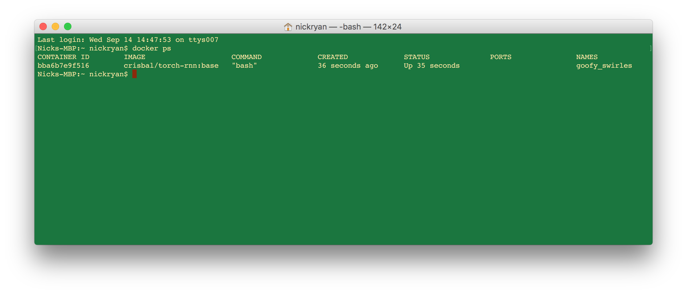
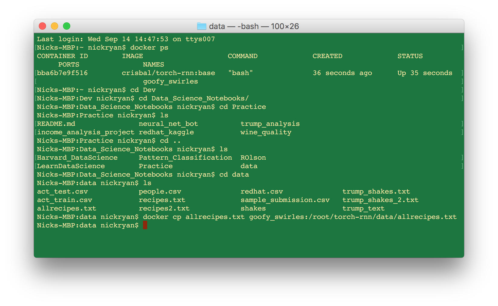
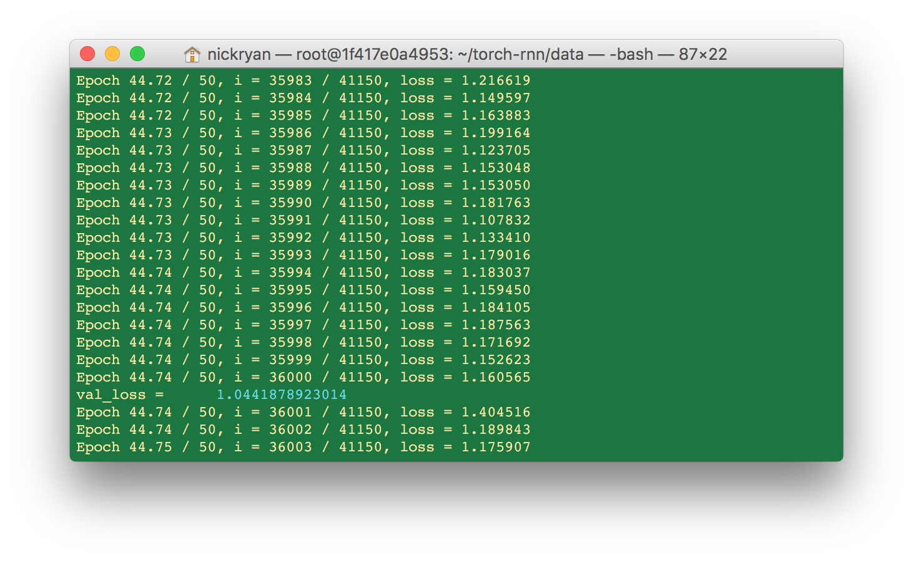
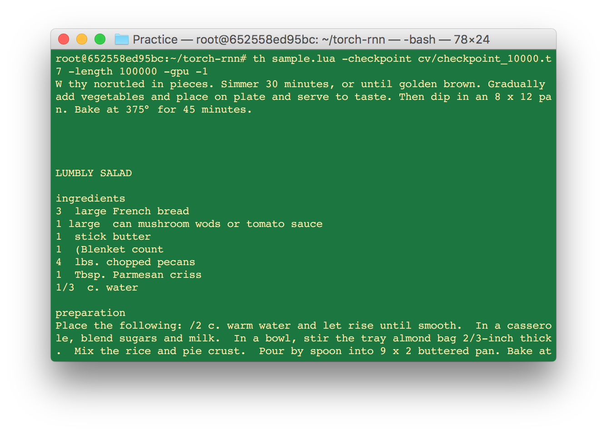

- recipe_scraper.ipynb uses BeautifulSoup to pull recipes from cookbooks.com
- images folder contains images for the tutorial
- data folder contains training datasets

# Recurrent Neural Network Tutorial

## Introduction
The purpose of this quick tutorial is to get you a very big, very useful neural network up and running in just a few hours. The goal is that anyone with a computer, some free time, and little-to-no knowledge of what neural networks are or how they work can easily begin playing with this technology as soon as possible. Technical explanations of what RNNs are abound on the internet, so this tutorial will skip explanation and focus solely on building.

With this neural network, you'll be able to feed in a body of text as input, and as output receive whatever the neural network believes is a good imitation of that input text. For example, given 3MB of recipes from cookbooks.com, my recurrent neural network (RNN from here on out) has so far produced thousands of culinary gems, including Salmon Cookies, Wee's Dippes, Pickles Quiche, Mexican Lasagna, Cajun Frosting, Cranberry Cocktrot Salad, and simple but delectable Bread Candy:

BREAD CANDY 

Ingredients
- 1  lb. cooked ham (fresh)
- 1  onion, chopped fine

Preparation

Combine butter, melted butter, sugar, vanilla and 1 cup with eggplant mixture. Spread evenly with cracker crumbs, butter cream and celery.  Add remaining ingredients except whips.  Chill in a large bowl according to package, and thinly slice mixture over the graham cracker crumbs.  Refrigerate.

### Who are you?
You don't need to have any keep knowledge of what a neural network is or how it works. Though the concepts and mathematics behind neural networks are fascinating and not *too* involved, if you like you can treat them as a black box in which something goes in and something comes out. Similarly, you don't need to to be a skilled programmer. The only real requirement is that you are comfortable opening up the terminal and can navigate directories which, if you don't already know how to do, can be learned in 15 minutes. For the most part, all you will need to do is download a few things off the internet and copy and paste the few short lines of code provided for you in this tutorial.

### Who built this?
One week ago, I sat down at the computer and decided I would like to play around with the latest AI technology. I've used neural nets before, but I wanted to see what a bigger, state-of-the-art neural network would produce if given 50% Shakespeare and 50% Donald Trump as input. There are a few tutorials out there,

https://medium.com/technology-invention-and-more/how-to-build-a-simple-neural-network-in-9-lines-of-python-code-cc8f23647ca1#.catnczqp3

but these are usually limited to explaining how vanilla NNs work and getting you started with an NN that can crunch a small array of numbers. But what if you want to build something big? 

I was lucky enough to stumble upon a tutorial of a tutorial of a tutorial which, amazingly, lets you set up an RNN with almost zero effort. The project in question is here, created by Andrej Karpathy, a researcher at OpenAI who holds a PhD in deep learning from Stanford: 
https://github.com/karpathy/char-rnn

His project has been maintained and optimized here:
https://github.com/jcjohnson/torch-rnn

And *his* project has received a docker implementation here:
https://github.com/crisbal/docker-torch-rnn

The nice thing about this project, and much of the reason why I'm creating this tutorial, is that running this on Docker means you don't have to worry about dependencies and compatibility (stuff to install that may or may not work on your computer). It occurred to me afterwards that aside from a few technical issues that I have tried to resolve for you in the instructions below, the entire process, end-to-end, was so simple that someone with almost no machine learning knowledge or programming skills could do it. 

So, let's begin:

## Build it

#### Step #1: Install Docker
Go to https://www.docker.com/ and install Docker. Open it up.

#### Step #2: Run Docker
Open up terminal and type:

docker run --rm -ti crisbal/torch-rnn:base bash

#### Step #3: Select your training data
Inside of the docker instance there's some sample Shakespeare data, but you're here because you want to train an RNN on something unique. Recipes? Donald Trump tweets? A math textbook? The Twilight series? 5MB of Miss Manners? Sci-Fi screenplays? Yelp reviews?

Whatever it is, you'll want at least 1MB of it, and we're going to move it from your local drive into the docker instance. 

#### Step #4: Moving your data into docker
Open up a new terminal window (not the one running docker) and type: 

docker ps

This will give you information about your docker instances that you will need. On the far right is a "NAME" column. I've opened up a few by now, and they all have superb names.

Now, in terminal you'll need to navigate to the directory that contains your data file. If you don't already know how to do that, there are plenty of resources on the internet. The first google result I got seems like a good reference:

http://www.macworld.com/article/2042378/master-the-command-line-navigating-files-and-folders.html

Once you have done this, you're going to copy this file over to the data folder in docker, like so:

docker cp FILENAME.txt NAMEOFYOURDOCKER:/root/torch-rnn/data/FILENAME.txt

where NAMEOFYOURDOCKER is what we found earlier with "docker ps" and FILENAME is the name of your data. For example, I'm training a neural network on recipe data in my docker named goofy_swirles, so I will put:

docker cp allrecipes.txt goofy_swirles:/root/torch-rnn/data/allrecipes.txt

#### Step #5: Preprocessing

Go back to the terminal window running docker, and type:

python scripts/preprocess.py \
  --input_txt data/FILENAME.txt \
  --output_h5 data/FILENAME.h5 \
  --output_json data/FILENAME.json
  
where FILENAME is the name of your file.
  
#### Step #6: Training Parameters

Now we're going to train our data. This is essentially the last step, but a few words before we do so.

Training the network takes a long time, minimum perhaps 6-12 hours. Fortunately, this goes on in the background without, at least for my MacBook, noticeably hurting your performance. Just a warning.

You will also need to set the training parameters to match your dataset. The more data you use and the bigger you make your model, the better it will be. Obviously, bigger model = more time spent training.

The details of setting parameters are included in the original repository, and if you want to get a well-performing model then you would be well-served to review the notes under "Tips and Tricks" here:

https://github.com/karpathy/char-rnn

But I will summarize and give you a very basic rule of thumb. 

- 1MB of data is considered pretty small, but is certainly still doable. The more data the better, but try something in the 2MB-5MB range first and see how it does before using larger datasets and potentially waiting multiple days for training to complete. You might be satisfied with the smaller-scale performance. 
- If you increase the dataset size you should increase the size of the neural network, done in either of two ways: number of layers and network size. 
  - Layers: The default is 2 layers. The author does not suggest using more than 3 layers. 
  - Size: The default is 128. With more than 2MB, you should increase the size and your network should work significantly better. I used size=250 for 3MB, which took about 15 hours and got pretty good performance. The author says that with 6MB you can increase the size to 300 or more. 
- The size of the model vs size of the dataset comes down to trial and error. It depends what your data looks like (Shakespearean language or highly regular recipe formats), how much time you're willing to spend training your network, and what you think is satisfactory performance. It's better to err on the side of a model that's too big, so for your first try, I suggest you do something on the rough scale of
  - 1MB, 2 layers, size 128
  - 2MB, 2 layers, size 200
  - 3MB, 2 layers, size 250
  - 6MB, 2 layers, size 400
And see how it goes. After that, you can refer to the authors "Tips and Tricks" section and play with network type, dropout rate, layers, etc.

#### Step #7: Training

To train, open the docker terminal window and type

th train.lua -input_h5 data/FILENAME.h5 -input_json data/FILENAME.json -gpu -1 -rnn_size 200 -num_layers 2

Explanation:
- "-gpu -1" If you don’t have a CUDA compatible GPU (you’d probably know if you did) or don’t know what that is, just add -gpu -1. If you do have a GPU, then lucky you: you should definitely omit -gpu -1 to get training to run a whole lot faster. If not, don't worry about it, it's just a speed boost.
- "-rnn_size 200" means we've selected a size of 200. 128 is the default.
- "-num_layers 2" just means we've selected 2 layers. 2 layers is the default, so if you want 2 layers, you can alternatively omit this.

Now you're going to see this for a while.

The program is going to run 50 epochs, stopping occassionally to compute the cross-validation loss. If you're interested, take a look at the original repository: these numbers can tell you how your model is performing and whether you need to increase/decrease model size on your next run.

#### Step #8: Sampling

Eventually your model will finish training and the prompt will reappear.

Now type 

th sample.lua -checkpoint cv/checkpoint_10000.t7 -length 2000 -gpu -1

Where "-lenth 2000" is the size of the sample you're taking. This generates 2000 characters and only takes a few seconds. Feel free to increase this.

That's it. You trained a recurrent neural network and generated samples from it. Congratulations! 

## After

Depending on your samples, you might want to run the network again and adjust the training parameters. Again, the best resource is Karpathy's repository, but it's safe to say that if your output is full of errors, spelling mistakes, irregularities, then you will want to increase the size of your model. 

### Resources

If you've made it this far, at this point you might be interested in learning a little more about how this technology works. I would recommend you take a look at a few of the following resources. I would provide my own technical discussion, but at there are already too many good ones out there today. Check out, in ascending order of technical depth:

[This](https://medium.com/technology-invention-and-more/everything-you-need-to-know-about-artificial-neural-networks-57fac18245a1#.9x1jgzlsh) and [this](https://medium.com/technology-invention-and-more/how-to-build-a-simple-neural-network-in-9-lines-of-python-code-cc8f23647ca1#.rb59ri3pv) look like good places to start understanding how they work and why they have enjoyed a good deal of popularity in the last few years.

- Karpathy's "The Unreasonable Effectiveness of Neural Networks." The author of this project discusses just what's going on inside of RNNs. Light on mathematics but heavy on subject matter, this is the best resource for understanding the details of the model you've just put into practice.
http://karpathy.github.io/2015/05/21/rnn-effectiveness/

- Andrew Ng's Machine Learning Course from Coursera, weeks 4 and 5. Not for the layman, but an excellent series of videos that will take you beyond a basic understanding and give you a strong conceptual model for how these work (including backpropogation). Requires some mathematical background (mostly linear algebra, familiarity with ideas in calculus) and a little familiarity with the subject

- Geoffrey Hinton's Neural Networks Course from Coursera. An entire class dedicated to neural networks. A very important figure in the field offers subject history, breadth and depth. Ideally requires a good deal of mathematical background and familiarity with the subject.

